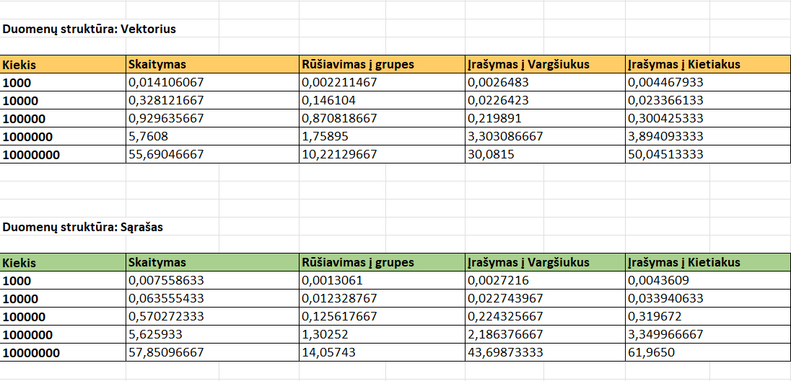
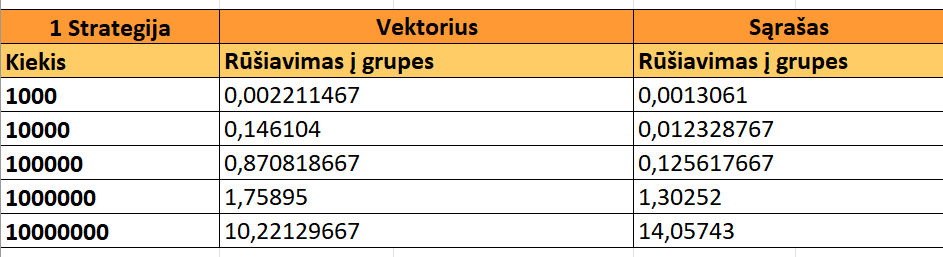
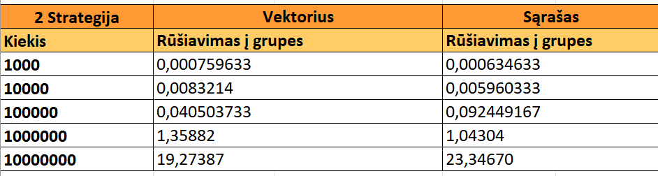
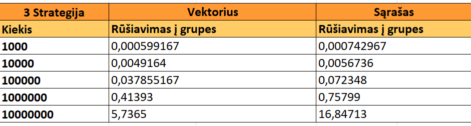
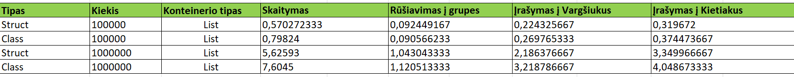
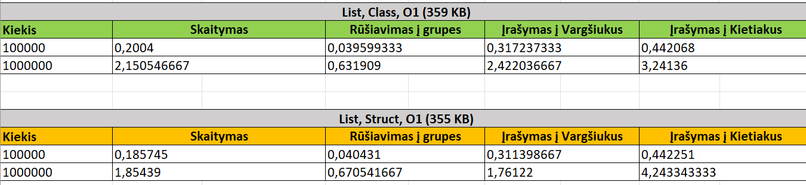
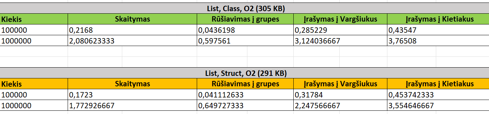
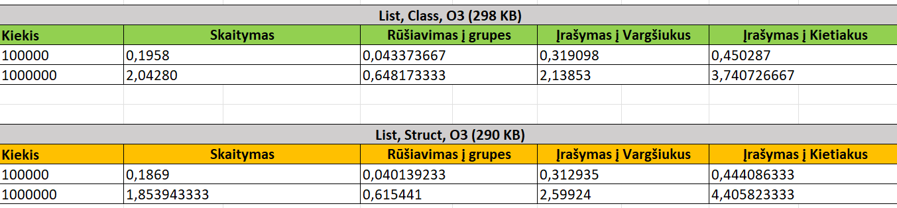

# Studentų analizė

## Programos diegimo ir paleidimo instrukcija:

Naudojant diegimo failą - setup.exe
Norint įdiegti ir paleisti programą naudojant setup.exe sekite šiuos žingsnius: 

Atsisiųskite naujausią versiją v3.0, ją rasite nueidami į "Releaase", pasirinkite v3.0 versiją ir paspauskite ant Source code (zip);
Atsisiuntus, išskleiskite failą;
Dukart spustelijus paleiskite setup.exe failą;
Pasirodžius langui, prašančiam administratoriaus teisių, paspauskite "YES", tada spustelėkite „Next“ (Kitas), kad tęstumėte diegimą;
Kai diegimas bus baigtas, paspauskite „Finish“ (Baigti), kad uždarytumėte diegimo vedlį;
Paleiskite programą iš pradžios meniu arba spustelėkite ant darbalaukyje atsiradusios piktogramos.
Norint pašalinti programą sekite šiuos žingsnius:

Susiraskite programą program files aplankale ("C:/Program files (x86)/VU/Evelina-Dudutyte");
Dukart spustelėkite ant unins000.exe failo, sekite vediklio nurodymus.

## Kaip naudotis programa:

Paleidus programą jūs pamatysite pasirinkimą dėl **duomenų struktūros**, rinktis reikės tarp vektoriaus arba sąrašo, galite rinktis kurį norite, rezultatas nuo to nepasikeis, gali pasikeisti tik vykdymo laikas. Atsakius į šį klausimą, jūs pasitiks kitas, reikės pasirinkti dėl **programos vykdymo**, reikės įvestį raidę, kuri atstovaus jūsų pasirinkimą.

### Programos vykdymo pasirinkimas:

***'I' - duomenų įvedimas***:
- Įveskite 'I' raidę.
- Pirmas klausimas bus šis: 'Kiek studentų norite įtraukti į sistemą:', įveskite skaičių.
- Toliau prasidės klausimai susije su pačiais studento duomenimis (šie klausimai kartosis tiek kartų, kiek nurodėte studentų):
    - Reikės pateikti vardą bei pavardę;
    - Pasirinkti dėl namų darbų bei egzamino įvertinimų įrašymo ranka ar atsitiktinio generavimo.
    - Jei pasirinksite `taip`, tai duomenis bus sugeneruoti atsitiktinai dešimtbalėje skaičiavimo sistemoje, tačiau reikės nurodyti norimą namų darbų kiekį.
    - Jei pasirinkite `ne`, tai duomenis reikės įvesti ranka. (pavyzdys: '8' spaudžiate 'enter' klavišą, tada įvedate '9' ir vėl spaudžiate 'enter' klavišą, norėdami užbaigti įvedimą, spauskite du kart 'enter' klavišą).
- Kitame klausime bus klausiama dėl rezultatų, ar norite, kad bendras įvertinimas būtų apskaičiuotas naudojant vidurkį (V) ar medianą (M). (Galutinis = 0.4 * vidurkis (arba medianą) + 0.6 * egzaminas).
- Toliau reikės pasirinkti dėl studentų duomenų rūšiavimo: pagal vardą ir pavarde - 'VP', pagal pavardę ir vardą - 'PV', pagal galutinį įvertinimą mažėjančia tvarka - 'GM', pagal galutinį įvertinimą didėjančia tvarka - 'GD'.
- Toliau reikės pasirinkti kur norite matyti rezultatus ar terminale (ten kur atsakinėjant į klausimus) ar išvesti juos į rezultatų failą. Tai pasirinksite tarp 'T' - terminalas ir 'F' - Failas.
- Pasirinkus 'T' atsakymai iš kart bus pateikti terminale.
- Pasirinkus 'F' atsakymai bus pateikti 'rez.txt' faile, kurį rasite sugeneruotame aplankale su pavadinimų 'Release'.

***'N' - duomenų nuskaitymas iš failo***:
- Įveskite 'N' raidę.
- Toliau reikės įvesti norimo failo pavadinimą. Tačiau pirmiausia įkelkite norimą failą į jau sugeneruotą aplankalą pavadinimu 'Release'.
- Kitame klausime klaus dėl rezultatų, ar norite, kad bendras įvertinimas būtų apskaičiuotas naudojant vidurkį (V) ar medianą (M). (Galutinis = 0.4 * vidurkis (arba medianą) + 0.6 * egzaminas)
- Toliau reikės pasirinkti dėl studentų duomenų rūšiavimo: pagal vardą ir pavarde - 'VP', pagal pavardę ir vardą - 'PV', pagal galutinį įvertinimą mažėjančia tvarka - 'GM', pagal galutinį įvertinimą didėjančia tvarka - 'GD'.
- Toliau reikės pasirinkti kur norite matyti rezultatus ar terminale (ten kur atsakinėjant į klausimus) ar išvesti juos į rezultatų failą. Tai pasirinksite tarp 'T' - terminalas ir 'F' - Failas. Didesnius failus rekomenduojama išvesti į 'rez.txt' failą.
- Pasirinkus 'T' atsakymai iš kart bus pateikti terminale.
- Pasirinkus 'F' atsakymai bus pateikti 'rez.txt' faile, kurį rasite sugeneruotame aplankale su pavadinimų 'Release'.

***'G' - atsitiktinių duomenų generavimas***:
- Įveskite 'G' raidę.
- Programa sugeneruos 5 studentų duomenų failus su įrašų kiekių: 1000, 10000, 100000, 1000000, 10000000.
- Failų pavadinimai priklauso nuo įrašų kiekio:
    - Studentai_1000.txt
    - Studentai_10000.txt
    - Studentai_100000.txt
    - Studentai_1000000.txt
    - Studentai_10000000.txt
- Šie failai atsiras naujai sukurtame aplankale su pavadinimu 'Release'.

***'T' - failų testasvimas***:
- Įveskite 'T' raidę.
- Reikės pasirinkti strategiją, tai pasirinkite kuria norite, rekomenduodama 3 strategija. (Strategijų aprašymą rasite žemiau).
- Kitame klausime klaus dėl rezultatų, ar norite, kad bendras įvertinimas būtų apskaičiuotas naudojant vidurkį (V) ar medianą (M). (Galutinis = 0.4 * vidurkis (arba medianą) + 0.6 * egzaminas)
- Toliau reikės pasirinkti dėl studentų duomenų rūšiavimo: pagal vardą ir pavarde - 'VP', pagal pavardę ir vardą - 'PV', pagal galutinį įvertinimą mažėjančia tvarka - 'GM', pagal galutinį įvertinimą didėjančia tvarka - 'GD'.
- Kad prasidėtų testavimas jums reikės pateikti duomenų failo pavadinimą. Tačiau pirmiausia įkelkite norimą failą į jau sugeneruotą aplankalą pavadinimu 'Release' arba įveskite pavadinimą iš jau automatiškai sugeneruotų failų, jei anksčiau leidote programą ir įvedėte 'S'.
- Daugiau nieko nebereikės pasirinkti, testavimas bus atliktas ir pamatysite atliktus veiksmus ir dalie jų vykdymo laikus.
- Testavimo metu atliekami šie veiksmai:
    - Duomenų nuskaitymas iš failo.
    - Galutinių įvertinimų skaičiavimas.
    - Studentų duomenų rūšiavimas.
    - Rezultatų atspausdinimas į 'rez.txt' failą.
    - Studentai bus suskirstomi į dvi grupes pagal galutinį įvertinimą į 'vargškiukus'(galutinis balas < 5.0 ) ir 'kietiakus' (galutinis balas >= 5.0) pagal pasirinktą strategiją.
    - Studentų duomenis bus pateikti failuose: 'rez.txt', 'Vargsiukai.txt', 'Kietiakai.txt' failuose.
- Rezultatų failus rasite naujai sukurtame aplankale su pavadinimu 'Release'.

***'D' - demmonstracija***:
- Įveskite 'D' raidę.
- Reikės pateikti vieno studento vardą bei pavardę.
- Toliau reikės pasirinkti dėl namų darbų bei egzamino įvertinimų įrašymo ranka ar atsitiktinio generavimo.
- Demonstracijos metu naudojami:
    - Įvesties operatorius.
    - Išvesties operatorius.
    - Kopijavimo konstruktorius.
    - Kopijavimo operatorius.
- Toliau terminale matysite atspausdinta pavyzdį.

## Release'ų aprašymas:

- ***v0.1 pradinėje*** versijoje sukūriama 'Studentas' struktūra studento duomenims saugoti. Vartotojas privalo įvesti kiekį studentų, kuriuos nori įtraukti į sistemą, pateikti jų varbus bei pavardes, gali įvertinimų duomenis įvesti ranka arba sugeneruoti atsitiktinai dešimtbalėje skačiavimo sistemoje. Pagal vartotojo įvestus ar sugeneruotus duomenis yra apskaičiuojamas galutinis įvertinimas pagal vidurkį ir galutinis įvertinimas pagal medianą. Vartotojui pasirinkus norima įvertinimo būdą yra atspausdinama lentelė su pateiktais įvertinimais.

- ***v0.1*** versijoje programos vykdymo pasirinkimas yra papildomas duomenų nuskaitymų iš failo (įvedus 'N' raidę) funkcija. Pasirinkus nuskaitymą vartotojas privalo pateikti duomenų failo pavadinimą. Taip pat, įvestas naujas pasirinkimas vartotojui dėl studentų rezultatų išvedimo, pasirinkus 'T' - rezultatas išvedamas terminale, ekrane, pasirinkus 'F' - rezultatas išvedamas 'rez.txt' faile. Rezultatai pateikiami surūšiuoti pagal vardus (ar pavardes), vartotojo įvedimams tikrinti yra panaudojamas išimčių valdymas.

- ***v0.2*** versija yra papildoma studentų duomenų failų generavimų. Yra sugeneruojami 5 failai, sudaryti iš: 1 000, 10 000, 100 000, 1 000 000, 10 000 000 įrašų. Studentai yra suskirstomi į dvi kategorijas (galutinis balas < 5.0 - 'Vargsiukus', galutinis balas >= 5.0 - 'Kietiakus') ir atspausdinimi skiringuose failuose pagal jas. Su sugeneruotais failais atlikta programos veikimo greičio (spartos) analizė.

- ***v0.3*** versija yra papildoma pasirinkimu, dirbti ne tik su vektoriu, bet ir su sąrašu.

- ***v1.0*** versija yra papildoma trejomis strategijomis, kurios skirtos studentų skirstymui į dvi grupes. (Strategijos aprašomos žemiau).

- ***v1.1*** versija yra papildoma 'Studento' klase, tai yra, ansktesnė 'Studento' struktūra yra perdaroma į klasę. Sukurti keli 'Studento' klasės konstruktoriai, pagal kuriuos bus sukuriami 'Studento' klasės objektai, ir pridėtas destruktorius, kuris atsakingas dėl 'Studento' objektų šalinimo bei vietos atlaisvinimo. Programos kodas pakoreguotas, kad veiktų pagal naująją 'Studento' klasę.

- ***v1.2*** versija papildoma "Rule of three" - trijų metodų taisykle (aprašymas pateikiamas žemiau) ir įvesties bei išvesties operatoratoriais (aprašymas pateikiamas žemiau), programoje pritaikomas išvesties operatorius tiek į failą, tiek į terminalą. Įvesties operatorius pritaikomas pavyzdyje ("D - demonstracijoje"). 

- ***v1.5*** versija papildyta bazine (abstrakčia) klase 'Zmogus' ir jos išvestine (derived) klase - Studentas. 'Zmogaus' klasė yra abstrakčioji klasė, tai yra negalima sukurti žmogaus tipo objektų, tačiau galima sukurti objektus iš jos išvestinės, 'Studento' klasės.

- ***v2.0*** versija papildyta doxygen kodo dokumentacija, dokumencija sukurta 'html' ir 'latex' formatu. Realizuoti Unit Testai naudojant Google testus (https://github.com/google/googletest). Atliktas testavimas: konstruktoriui su parametrais, priskyrimo operatoriui, galutinio įvertinimo apskaičiavimui pagal vidurkį, galutinio įvertinimo apskaičiavimui pagal medianą.

## Strategijų aprašymas: (Skirtos studentų skaidymui į dvi grupes)

- ***1 strategija*** Bendro studentai konteinerio (vector ir list tipų) skaidymas į du naujus to paties tipo konteinerius: "vargšiukų" ir "kietiakų". Tokiu būdu tas pats studentas yra dvejuose konteineriuose: bendrame studentai ir viename iš suskaidytų (vargšiukai arba kietiakai). 

- ***2 strategija*** Bendro studentų konteinerio (vector ir list) skaidymas panaudojant tik vieną naują konteinerį: "vargšiukai". Tokiu būdu, jei studentas yra vargšiukas, jį turime įkelti į naująjį "vargšiukų" konteinerį ir ištrinti iš bendro studentai konteinerio. Po šio žingsnio studentai konteineryje liks vien tik kietiakai.

- ***3 strategija*** Bendro studentų konteinerio (vector ir list) skaidymas (rūšiavimas) panaudojant 2 strategiją. Pritaikyta std::stable_partition() funkcija.

## Duomenų įvesties ir išvesties operatoriai:

- Duomenų įvesties operatorius:
    - Naudojamas perdengtas operatorius `istream& operator>>(std::istream& is, Studentas& s)`, kuris leidžia įvesti duomenis dviem būdais: 
        1. Rankinis įvedimas iš terminalo, naudojant `std::cin`. Vartotojas turi pateikti studentų vardus bei pavardes, įvertinimai gali būti įvesti vartotojo rankiniu būdu arba sugeneruojami atsitiktinai pagal vartotojo pasirinkimą.
        2. Duomenų nuskaitymas iš teksto srauto (pvz.: `std::stringstream`).
    - Operatorius priima tik du kintamuosius:
        1. Srauto objektą: `std::istream& is`
        2. Objektą `(Studentas& s)`, kuriame bus saugomi nuskaityti duomenys: vardas, pavardė, namų darbai ir egzamino įvertinimas.

- Duomenų išvesties operatorius:
    - Operatorius naudojamas tiek išvedimui į terminalą `std::cout`, tiek rašymui į failą `std::ofstream`.
    - Operatorius priima tik du kintamuosius:
        1. Srauto objektą: `std::istream& is`.
        2. Objektą `Studentas& s`, kurio duomenys bus išvedami.

## "Rule of three" - trijų metodų taisykė:

- `Destruktorius` - atsakingas už sukurtų objektų ir jų duomenų atminties atlaisvinimą, yra kviečiamas automaitškai.
- `Kopijavimo konstruktorius` - naudojamas, kai yra sukuriamas naujas objektas ir duomenys yra jam perkopijuojami jau iš kito egzistuojančio objekto. 
- `Kopijavimo priskyrimo operatorius` - naudojamas, kai jau egzistuojančiam objektui yra perrašomi kito ojbekto duomenys. 

    
## Programos veikimo greičio (spartos) analizė ir Release'ų resultatų analizė:

### Failų generavimo laikas:
- `1000` įrašų: **0.0038736 s.**
- `10000` įrašų: **0.02257958 s.**
- `100000` įrašų: **0.192953 s.**
- `1000000` įrašų: **1.9046325 s.**
- `10000000` įrašų: **19.2343 s.**

### Testavimo laikai:

('Rūšiavimas į grupes' - skaidymas į grupes, buvo naudojama 1 strategija).

### Trumpa analizė:
- **Duomenų skaitymas:** Sąrašas (list) greičiau nuskaitynėja duomenis mažesniose failuose, tačiau vektorius (vector) greičiau skaito failą su 10 mln. įrašų.
- **Rūšiavimas į grupes:** Sąrašas greičiau rūšiuoja, skirsto į dvi grupes duomenis mažesniose failuose, tačiau vektorius greičiau skirsto failą su 10 mln. įrašų.
- **Įrašymas į failus:** Tiek sąrašas, tiek vektorius užtrunka panašiai laiko įrašydamas duomenis į "Vargšiukus" ir "Kietiakus" failus. Tačiau vektorius greičiau įrašynėja su didesniu kiekiu įrašų (10 mln.).

### Strategijų testavimo laikai dirbant su vektoriu ir sąrašu

### Trumpa analizė: (Duomenų skaidymo į dvi grupes, efektyvumas laiko atžvilgiu)

- **1 Strategija:** 
    - Sąrašas efektyviau su mažesnių kiekiu duomenų (iki 10mln).
    - Vektorius efektyviau su 10 mln. kiekiu duomenų.

- **2 Strategija:** 
    - Sąrašas efektyviau naudojant su 1000, 10000, 1000000 įrašų.
    - Vektorius efektyviau naudojant su 100000, 10000000 įrašų.

- **3 Strategija:** 
    - Visais atvejais vektorius efektyviausias.

- **Rekomendacija:**
    - Naudoti 3 strategiją laiko atžvilgiu yra efektyviausia.

### Struct ir Class testavimo laikai:
Testavimas atliktas naudojant vieną fiksuotą konteinerį (sąrašą (list)), studentų skaidymui buvo naudojama 2 strategija.
Testavimas atliktas su 100000 ir 1000000 dydžio failais.

### Trumpa analizė:

- **Duomenų skaitymas:** Programa naudojant *Struct* greičiau nuskaito duomenis, tiek iš failą su 100000 įrašų, tiek failą su 1000000 įrašų.
- **Rūšiavimas į grupes:** Tiek naudojant programą su *Struct*, tiek su *Class* gaunamas panašus laikas skaidant studentus.
- **Įrašymas į failus:** Abi programos įrašo panašiu greičiu, tačiau naudojant *Struct* įrašymas vyksta truputi greičiau.

### Kompiliatoriaus optimizavimas (Skliausteliuose pateikiamas .exe failo dydis)
Kompiliatoriaus optimizavimo lygiai, nurodomi per flag'us: O1, O2, O3.

**O1:**

**O2:**

**O3:**

### Trumpa analizė:

- **Duomenų skaitymas:** Skaitymas buvo greičiausas naudojant O2 optimizavimo lygį (List, Struct, O2 (291 KB)).
- **Rūšiavimas į grupes:** Rūšiavimo rezultatai labai panašūs tarp optimizavimo lygių.
- **Įrašymas į failus:** Duomenų įrašymo rezultatai, taip pat panašūs tarp optimizavimo lygių, tačiau greičiausia naudojant O1 optimizavimo lygį (List, Struct, O1 (355 KB)).
- **Dydžiausias .exe failo dydis:** O1 359 KB (List, Class)
- **Mažiausias .exe failo dydis:** O3 290 KB (List, Struct)

## Testavimo sistemos parametrai:

- CPU - AMD Ryzen 7 7730U with Radeon Graphics  2.00 GHz
- RAM - 16.0 GB
- SSD - INTEL SSDPEKNU512GZH
